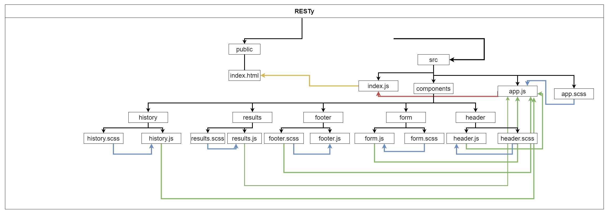

# Lab: Class 28

## Index

- [LAB - Props and State](#LAB---Props-and-State)
- [Business Requirements](#Business-Requirements)
- [Phase 3 Requirements](#Phase-3-Requirements)
- [Technical Requirements / Notes](#Technical-Requirements-/-Notes)
- [The lab tree](#The-lab-tree)
- [Testing](#Testing)
- [More about the Lab](#More-about-the-Lab)
  - [Author](#Author)
  - [Github](#Github)
  - [UML](#UML)
  - [Tests](#Tests)
  - [Tests](#App)
- [Author Links](#Author-Links)
- [Back to main README](../../../README.md)
- [Back to head or the repo](https://github.com/shadykh/resty)

---

# LAB - Component Composition

**RESTy Phase 3:** Add conditional rendering to RESTy

## Before you begin

Refer to *Getting Started*  in the [lab submission instructions](../../../reference/submission-instructions/labs/README.md) for complete setup, configuration, deployment, and submission instructions.

> Continue working in your 'resty' repository, in a branch called 'composition'


**[⬆ Back to Index](#index)**

---

## Business Requirements

Refer to the [RESTy System Overview](../../apps-and-libraries/resty/README.md) for a complete review of the application, including Business and Technical requirements along with the development roadmap.


**[⬆ Back to Index](#index)**

---


## Phase 3 Requirements

In this phase of the RESTy build, we will be adding some more fidelity to the application, including a menu, history, and an "in-progress" spinner.

The following user stories detail the major functionality for this phase of the project.

- As a user, I want to be able to use all REST methods so that I can do more than just **get** data
- As a user, I want a simple list of all previous queries I've run so that I can easily see which queries I've run before
- As a user, I want to click on an old query and have my selections appear in the form for me, so I don't have to re-type them
- As a user, I want to see a "loading" indicator while RESTy is fetching data so that I know it's working on my request

**[⬆ Back to Index](#index)**

---


## Technical Requirements / Note

Update the RESTy application as follows:

- Add support for **PUT**, **POST**, and **DELETE** in your remote calls
- Whenever a query is successful (results come back), store the query parameters in local storage
  - Store the URL, Method, and the Body (if any)
  - Store only unique, successful queries

Home Page

- Add a simple history list to the left side of the application
  - List all previous queries, showing the method and the URL
  - When a user clicks a previous query, populate the RESTy forms with the query information
- Completely hide the output area (Headers & Results) when there are none to display
- Display any fetch/load errors in place of the results area, if they occur
- Add a "Loading" indicator while fetching
  - When the user clicks the "Go!" button, show a loading icon on the page
  - When the fetching of results is complete, remove the loading icon and show the results

### Application Architecture Notes

- Alter the `<Results />` component as follows:
  - Add support for all REST methods
  - Use a conditional component such as `<If>` to hide/show the results pane when there are none
  - Use a conditional component such as `<If>` to hide/show a loading image during the fetch process
- Create a new `<History/>` inline component that will:
  - Show a simple history list on the main page
  - Allow a user to click and re-run any previous query

**[⬆ Back to Index](#index)**

---


#### **The lab tree**

```
├── .gitignore
├── .eslintrc.json
├── __tests__
│   ├── app.test.js
│   ├── form.test.js
│   ├── history.test.js
│   ├── results.test.js
├── src
│   ├── index.js
│   ├── app.js
│   ├── components
│   │   ├── if
│   │   │   └── if.js
│   │   ├── form
│   │   │   └── form.js
│   │   │   └── form.scss
│   │   ├── history
│   │   │   └── history.js
│   │   │   └── history.scss
│   │   ├── results
│   │   │   └── results.js
│   │   │   └── results.scss
│   │   ├── header
│   │   │   └── header.js
│   │   │   └── header.scss
│   ├── design
│   │   └── variables.scss
│   │   └── design.scss
└── package.json
```

**[⬆ Back to Index](#index)**

---

### **More about the Lab**

- #### Author

  - Shady Khaled

  **[⬆ Back to Index](#index)**

- #### Github

  - For the repo ***resty*** clicks => [here](https://github.com/shadykh/resty).
  - Pull Requests:
    - [https://github.com/shadykh/resty/pull/6](https://github.com/shadykh/resty/pull/6)

**[⬆ Back to Index](#index)**

- #### UML

  - 

**[⬆ Back to Index](#index)**

- #### Deployed Site

  - [RESTy](https://60d20883341eb6297961172a--restyapp001.netlify.app/)

**[⬆ Back to Index](#index)**

- #### App

  - run `npm start`

- I did this lab with help of
  - dependencies
    - node-sass
    - react
    - react-dom
    - react-scripts
    - web-vitals
  - framework
    - Node.js
    - React
  - tools
    - Github.
    - VsCode.
    - Ubuntu.

**[⬆ Back to Index](#index)**

<br>

---
<br>

## Author Links

- ### Shady Khaled github ✅

  - [Shady Khaled](https://github.com/shadykh)

- ### Shady Khaled reading notes 📚

  - [Shady Khaled reading notes](https://shadykh.github.io/reading-notes/)

- ### Shady Khaled portfolio 💬

  - [Shady Khaled portfolio](https://portfolio-shady.herokuapp.com/)
