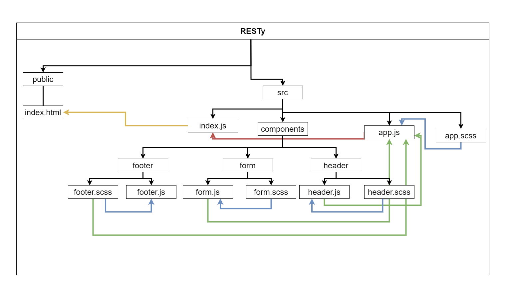

# Lab: Class 26

## Index

- [LAB - Component Based UI](#LAB---Component-Based-UI)
- [Business Requirements](#Business-Requirements)
- [Phase 1 Requirements](#Phase-1-Requirements)
- [Technical Requirements / Notes](#Technical-Requirements-/-Notes)
- [The lab tree](#The-lab-tree)
- [Testing](#Testing)
- [More about the Lab](#More-about-the-Lab)
  - [Author](#Author)
  - [Github](#Github)
  - [UML](#UML)
  - [Tests](#Tests)
  - [Tests](#App)
- [Author Links](#Author-Links)
- [Back to main README](../../../README.md)

---

# LAB - Component Based UI

**RESTy Phase 1:** Begin work on the RESTy API testing application

## Before you begin

Refer to *Getting Started*  in the [lab submission instructions](../../../reference/submission-instructions/labs/README.md) for complete setup, configuration, deployment, and submission instructions.

Create a UML diagram of the **RESTy** system on a whiteboard before you start

> Create a new repository for this project, called 'resty' and work in a branch called 'base'

## Business Requirements

Refer to the [RESTy System Overview](../../apps-and-libraries/resty/README.md) for a complete review of the application, including Business and Technical requirements along with the development roadmap.

## Phase 1 Requirements

Today, we begin the first of a 4-Phase build of the RESTy application, written in React. In this first phase, our goal is to setup the basic scaffolding of the application, with intent being to add more functionality to the system as we go. This initial build sets up the file structure so that we can progressively build this application in a scalable manner

The following user/developer stories detail the major functionality for this phase of the project.

- As a user, I expect an easy to read and understand user interface so that I can use the application intuitively
- As a user, I want to enter the URL to a REST API and select the REST method to use to access it
- As a user, I want visual confirmation that my entries and selections are valid so that I have confidence the application will be able to fetch the API data that I've requested

And as developers, here are the high level development tasks that address the above end user requirements

- Create a visually appealing site with a Header, Footer, and a large content area
- Create a form that asks for a URL
- Create buttons that let the user choose from the REST methods (get, post, put, delete)
- When the form is filled out, and the button is clicked, display the URL and the method chosen

## Technical Requirements / Notes

Create the RESTy application as follows:

- Begin with creating your application using `create-react-app`
- Write an `App` component that serves as the container for all sub-components of this application
  - The app should import an `.scss` file to serve as the base design for the site
  - Import and render `Header`, `Footer`, and `Form` components from other files using ES6 `import` syntax
- The `<Header>` component should use it's own `.scss` file for styling
- The `<Footer>` component should use it's own `.scss` file for styling
- The `<Form>` component should:
  - Use it's own `.scss` file for styling
  - Accept user input for a URL and store it in state
  - Allow the user to choose a method and store it in state
    - This can be done with radio buttons or clickable elements
  - Display the user's choices on screen in a separate `<div>` or `<section>` under the form

---

**[⬆ Back to Index](#index)**

#### **The lab tree**

```
├── .gitignore
├── .eslintrc.json
├── __tests__
│   ├── app.test.js
│   ├── form.test.js
│   ├── history.test.js
│   ├── results.test.js
├── src
│   ├── index.js
│   ├── app.js
│   ├── components
│   │   ├── if
│   │   │   └── if.js
│   │   ├── form
│   │   │   └── form.js
│   │   │   └── form.scss
│   │   ├── history
│   │   │   └── history.js
│   │   │   └── history.scss
│   │   ├── results
│   │   │   └── results.js
│   │   │   └── results.scss
│   │   ├── header
│   │   │   └── header.js
│   │   │   └── header.scss
│   ├── design
│   │   └── variables.scss
│   │   └── design.scss
└── package.json
```

**[⬆ Back to Index](#index)**

#### **Testing**

- > NOTE: For this assignment, **testing is not required**

**[⬆ Back to Index](#index)**

### **More about the Lab**

- #### Author

  - Shady Khaled

  **[⬆ Back to Index](#index)**

- #### Github

  - For the repo ***resty*** clicks => [here](https://github.com/shadykh/resty).
  - Pull Requests:
    - [https://github.com/shadykh/resty/pull/1](https://github.com/shadykh/resty/pull/1)

**[⬆ Back to Index](#index)**

- #### UML

  - 

**[⬆ Back to Index](#index)**

- #### Tests

- > NOTE: For this assignment, **testing is not required**

**[⬆ Back to Index](#index)**

- #### App

  - run `npm start`

- I did this lab with help of
  - dependencies
    - node-sass
    - react
    - react-dom
    - react-scripts
    - web-vitals
  - framework
    - Node.js
    - React
  - tools
    - Github.
    - VsCode.
    - Ubuntu.

**[⬆ Back to Index](#index)**

<br>

---
<br>

## Author Links

- ### Shady Khaled github ✅

  - [Shady Khaled](https://github.com/shadykh)

- ### Shady Khaled reading notes 📚

  - [Shady Khaled reading notes](https://shadykh.github.io/reading-notes/)

- ### Shady Khaled portfolio 💬

  - [Shady Khaled portfolio](https://portfolio-shady.herokuapp.com/)
