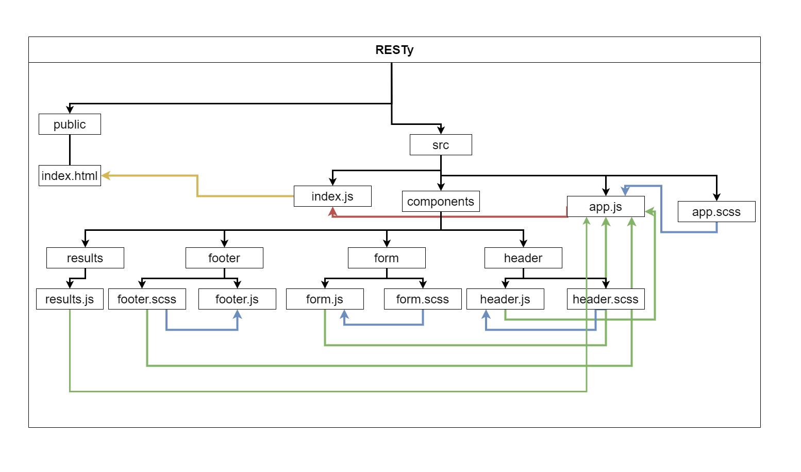

# Lab: Class 27

## Index

- [LAB - Props and State](#LAB---Props-and-State)
- [Business Requirements](#Business-Requirements)
- [Phase 2 Requirements](#Phase-2-Requirements)
- [Technical Requirements / Notes](#Technical-Requirements-/-Notes)
- [The lab tree](#The-lab-tree)
- [Testing](#Testing)
- [More about the Lab](#More-about-the-Lab)
  - [Author](#Author)
  - [Github](#Github)
  - [UML](#UML)
  - [Tests](#Tests)
  - [Tests](#App)
- [Author Links](#Author-Links)
- [Back to main README](../../../README.md)
- [Back to head or the repo](https://github.com/shadykh/resty)

---

# LAB - Props and State

**RESTy Phase 2:** Connect RESTy with APIs, running live requests

## Before you begin

Refer to *Getting Started*  in the [lab submission instructions](../../../reference/submission-instructions/labs/README.md) for complete setup, configuration, deployment, and submission instructions.

> Continue working in your 'resty' repository, in a branch called 'props-and-state'


**[⬆ Back to Index](#index)**

---

## Business Requirements

Refer to the [RESTy System Overview](../../apps-and-libraries/resty/README.md) for a complete review of the application, including Business and Technical requirements along with the development roadmap.

**[⬆ Back to Index](#index)**

---


## Phase 2 Requirements

In phase 2, we will be connecting RESTy to live APIs, fetching and displaying remote data. Our primary focus will be to service *GET* requests

The following user stories detail the major functionality for this phase of the project.

- As a user, I want to enter the URL to an API and issue a GET request so that I can retrieve it's data
- As a user, I want to see the results returned from an API request in my browser in a readable format

Application Flow:

- User enters an API URL
- Chooses a REST Method
- Clicks the  "Go" button
- Application fetches data from the URL given, with the method specified
- Displays the response headers and results separately
- Both headers and results should be "pretty printed" JSON

> One possible design/layout. Please use your judgement and taste in styling your version of this application.


**[⬆ Back to Index](#index)**

---


## Technical Requirements / Note

Suggested Component Hierarchy and Application Architecture:

- `index.js` - Entry Point
- `app.js` - Container
  - Holds state: Count and Results Array
  - A class method that can update state
  - Renders 2 Child Components
- `<Form />`
  - Expects a function to be sent to it as a prop
  - Renders a URL entry form
  - A selection of REST methods to choose from ("get" should be the default)
  - On submit
    - Send the API results back to the `<App>` using the method sent down in props
- `<Results />`
  - Expects the count, headers, results to be sent in as props
  - Renders the count
  - Renders the Result Headers as "pretty" JSON
  - Renders the Result Body as "pretty" JSON

**[⬆ Back to Index](#index)**

---


#### **The lab tree**

```
├── .gitignore
├── .eslintrc.json
├── __tests__
│   ├── app.test.js
│   ├── form.test.js
│   ├── history.test.js
│   ├── results.test.js
├── src
│   ├── index.js
│   ├── app.js
│   ├── components
│   │   ├── if
│   │   │   └── if.js
│   │   ├── form
│   │   │   └── form.js
│   │   │   └── form.scss
│   │   ├── history
│   │   │   └── history.js
│   │   │   └── history.scss
│   │   ├── results
│   │   │   └── results.js
│   │   │   └── results.scss
│   │   ├── header
│   │   │   └── header.js
│   │   │   └── header.scss
│   ├── design
│   │   └── variables.scss
│   │   └── design.scss
└── package.json
```

**[⬆ Back to Index](#index)**

---

### **More about the Lab**

- #### Author

  - Shady Khaled

  **[⬆ Back to Index](#index)**

- #### Github

  - For the repo ***resty*** clicks => [here](https://github.com/shadykh/resty).
  - Pull Requests:
    - [https://github.com/shadykh/resty/pull/2](https://github.com/shadykh/resty/pull/2)

**[⬆ Back to Index](#index)**

- #### UML

  - 

**[⬆ Back to Index](#index)**


- #### App

  - run `npm start`

- I did this lab with help of
  - dependencies
    - node-sass
    - react
    - react-dom
    - react-scripts
    - web-vitals
  - framework
    - Node.js
    - React
  - tools
    - Github.
    - VsCode.
    - Ubuntu.

**[⬆ Back to Index](#index)**

<br>

---
<br>

## Author Links

- ### Shady Khaled github ✅

  - [Shady Khaled](https://github.com/shadykh)

- ### Shady Khaled reading notes 📚

  - [Shady Khaled reading notes](https://shadykh.github.io/reading-notes/)

- ### Shady Khaled portfolio 💬

  - [Shady Khaled portfolio](https://portfolio-shady.herokuapp.com/)
