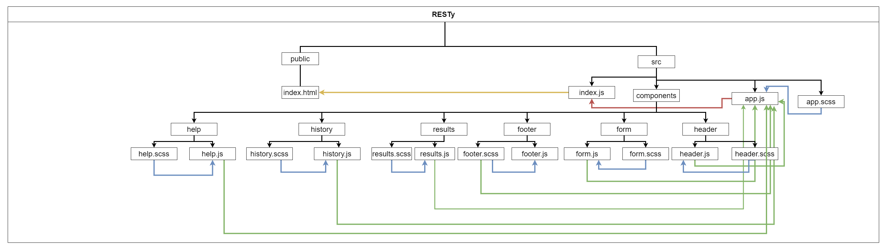

# Lab: Class 29

## Index

- [LAB - Props and State](#LAB---Props-and-State)
- [Business Requirements](#Business-Requirements)
- [Phase 4 Requirements](#Phase-3-Requirements)
- [Technical Requirements / Notes](#Technical-Requirements-/-Notes)
- [The lab tree](#The-lab-tree)
- [Testing](#Testing)
- [More about the Lab](#More-about-the-Lab)
  - [Author](#Author)
  - [Github](#Github)
  - [UML](#UML)
  - [Tests](#Tests)
  - [Tests](#App)
- [Author Links](#Author-Links)
- [Back to main README](../../../README.md)
- [Back to head or the repo](https://github.com/shadykh/resty)

---

# LAB - Routing

**RESTy Phase 4:** Add routing and conditional rendering to RESTy


## Before you begin

Refer to *Getting Started*  in the [lab submission instructions](../../../reference/submission-instructions/labs/README.md) for complete setup, configuration, deployment, and submission instructions.

> Continue working in your 'resty' repository, in a branch called 'composition'

**[⬆ Back to Index](#index)**

---

## Business Requirements

Refer to the [RESTy System Overview](../../apps-and-libraries/resty/README.md) for a complete review of the application, including Business and Technical requirements along with the development roadmap.


**[⬆ Back to Index](#index)**

---


## Phase 4 Requirements

In this final phase of the RESTy build, we will be adding some more fidelity to the application, including a menu with a ore detailed view of our history, as well as an about us page.

The following user stories detail the major functionality for this phase of the project.

- As a user, I want to see all of my previous queries as a separate page so that I can browse them in greater detail
- As a user, I would like to view a separate "Help" page so I can learn how the application works

**[⬆ Back to Index](#index)**

---


## Technical Requirements / Note

Update the RESTy application as follows:

- Add a menu bar to the header
  - Link labeled "Home" that links to '/' and shows the search form/results page
  - Link labeled "History" that links to '/history' and loads the history page
  - Link labeled "Help" that links to '/help' and loads the about us page

### Home Page

- Add a simple history list to the left side of the application
  - List all previous queries, showing the method and the URL
  - When a user clicks a previous query, populate the RESTy forms with the query information
- Completely hide the output area (Headers & Results) when there are none to display
- Display any fetch/load errors in place of the results area, if they occur
- Add a "Loading" indicator while fetching
  - When the user clicks the "Go!" button, show a loading icon on the page
  - When the fetching of results is complete, remove the loading icon and show the results

### History Page

- Maintain a list of every unique and successful API call the user has made
- On the History page, show a list of ever previous API call
  - Clicking on an entry shows the full details of that query in a separate section on the page
    - URL, Method, Body
    - Optionally, you can store other metadata about the query (time ran, bytes returned, etc) to show your users
  - Show a button labeled "Re-Run" that would execute that API call again and shows the home page with the form pre-filled

### Help Page
- Display static content detailing how a user should use the ReSTY application

### Application Architecture Notes

- Import `BrowserRouter` into your index, and wrap the `<App />` with it
- In the `<App />`, use routes to display the correct components, based on the route
- Create a new `<History/>` page component that will:
  - Show a list of URLs you've loaded before
  - Show full details of each search
  - Add a button to each to re-run the search
  - Redirect to the home page to show the results
- Create a new `<Help/>` page component that will:
  - Display static content to the users on how to use the application

**[⬆ Back to Index](#index)**

---


#### **The lab tree**

```
├── .gitignore
├── .eslintrc.json
├── __tests__
│   ├── app.test.js
│   ├── form.test.js
│   ├── history.test.js
│   ├── results.test.js
├── src
│   ├── index.js
│   ├── app.js
│   ├── components
│   │   ├── if
│   │   │   └── if.js
│   │   ├── form
│   │   │   └── form.js
│   │   │   └── form.scss
│   │   ├── history
│   │   │   └── history.js
│   │   │   └── history.scss
│   │   ├── results
│   │   │   └── results.js
│   │   │   └── results.scss
│   │   ├── header
│   │   │   └── header.js
│   │   │   └── header.scss
│   ├── design
│   │   └── variables.scss
│   │   └── design.scss
└── package.json
```

**[⬆ Back to Index](#index)**

---

### **More about the Lab**

- #### Author

  - Shady Khaled

  **[⬆ Back to Index](#index)**

- #### Github

  - For the repo ***resty*** clicks => [here](https://github.com/shadykh/resty).
  - Pull Requests:
    - [https://github.com/shadykh/resty/pull/9](https://github.com/shadykh/resty/pull/9)

**[⬆ Back to Index](#index)**

- #### UML

  - 

**[⬆ Back to Index](#index)**

- #### Deployed Site

  - [RESTy](https://restyapp001.netlify.app/)

**[⬆ Back to Index](#index)**

- #### App

  - run `npm start`

- I did this lab with help of
  - dependencies
    - node-sass
    - react
    - react-dom
    - react-scripts
    - web-vitals
    - react-router-dom
  - framework
    - Node.js
    - React
  - tools
    - Github.
    - VsCode.
    - Ubuntu.

**[⬆ Back to Index](#index)**

<br>

---
<br>

## Author Links

- ### Shady Khaled github ✅

  - [Shady Khaled](https://github.com/shadykh)

- ### Shady Khaled reading notes 📚

  - [Shady Khaled reading notes](https://shadykh.github.io/reading-notes/)

- ### Shady Khaled portfolio 💬

  - [Shady Khaled portfolio](https://portfolio-shady.herokuapp.com/)
